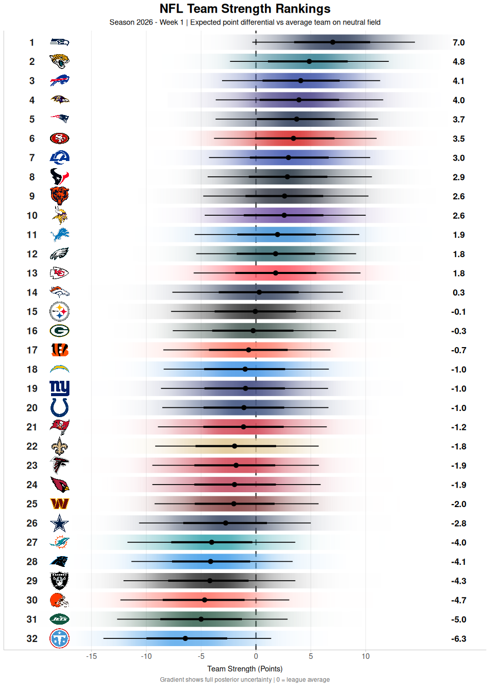
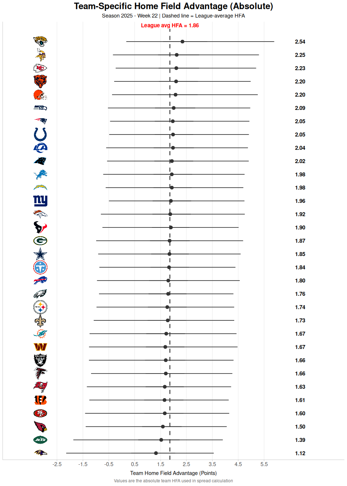
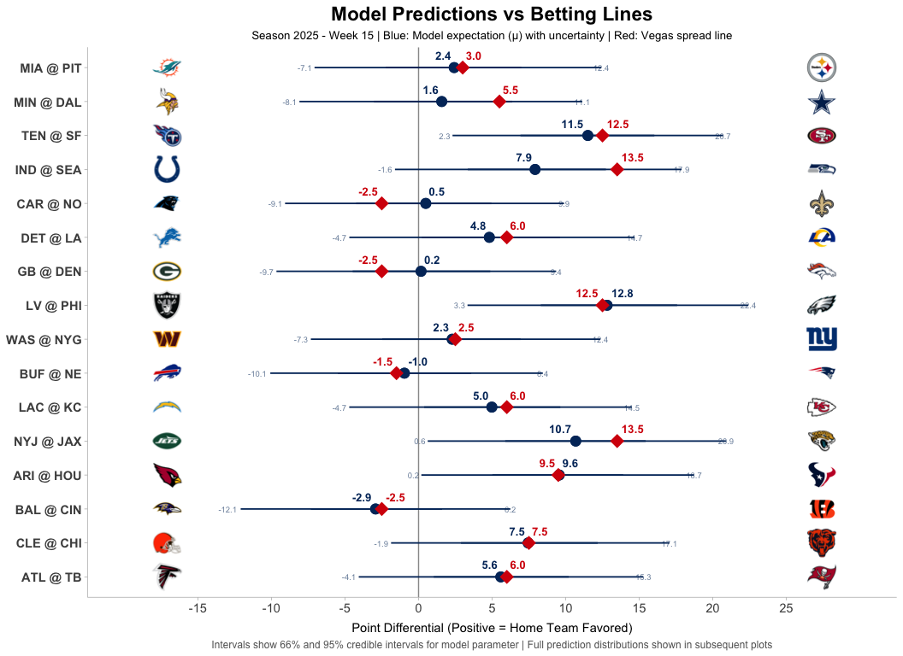
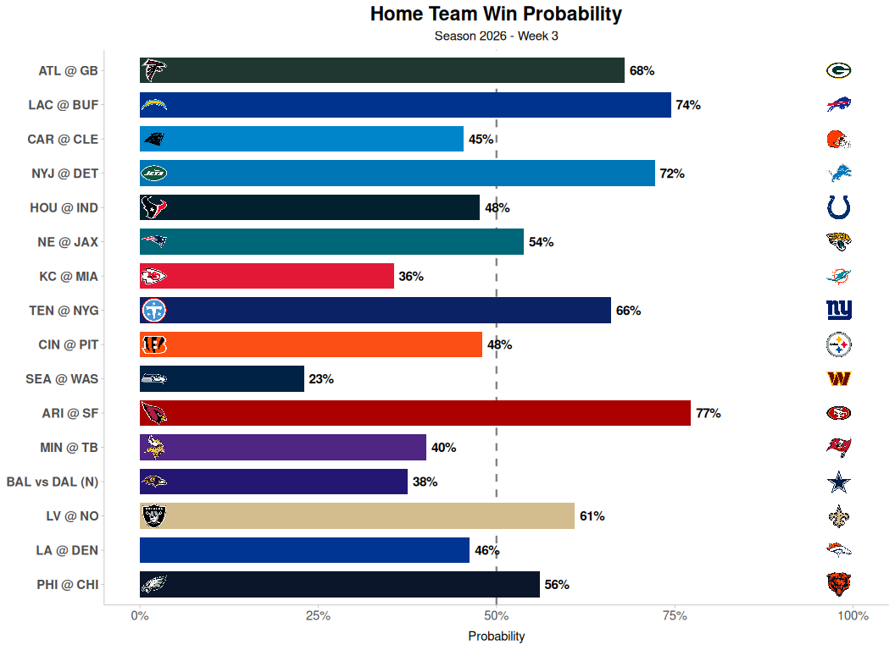
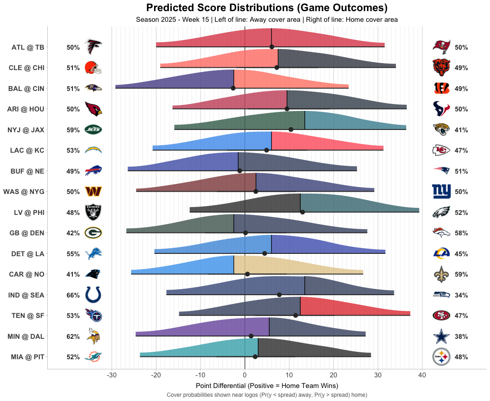
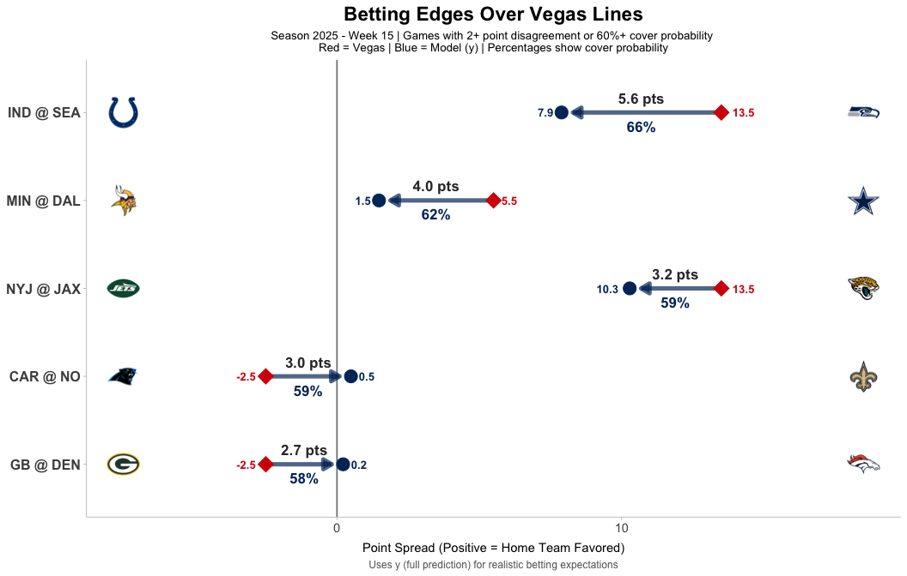

- [nflendzonePipeline](#nflendzonepipeline)
  - [Installation](#installation)
- [Weekly Report](#weekly-report)
  - [Data Setup](#data-setup)
  - [Load Model Estimates](#load-model-estimates)
  - [Team Strength Rankings](#team-strength-rankings)
  - [Home Field Advantage Comparison](#home-field-advantage-comparison)
  - [Weekly Game Predictions](#weekly-game-predictions)
    - [Expected Point Spreads vs Betting
      Lines](#expected-point-spreads-vs-betting-lines)
    - [Win Probability by Game](#win-probability-by-game)
    - [Predicted Score Distributions](#predicted-score-distributions)
    - [Betting Opportunities](#betting-opportunities)

<!-- README.md is generated from README.qmd. Please edit that file -->

# nflendzonePipeline

<!-- badges: start -->

[](https://lifecycle.r-lib.org/articles/stages.html#experimental)
<!-- badges: end -->

**Automated NFL game predictions and team strength estimates using
Bayesian state-space models.**

This package provides an automated pipeline for NFL analytics, with
weekly updates powered by GitHub Actions. The visualizations below are
automatically updated each week with the latest predictions and team
rankings.

## Installation

You can install the development version of nflendzonePipeline from
[GitHub](https://github.com/) with:

``` r
# install.packages("pak")
pak::pak("TylerPollard410/nflendzonePipeline")
```

# Weekly Report

This report provides weekly updates on NFL team strength estimates, home
field advantage, and game predictions using Bayesian state-space models.

<details class="code-fold">
<summary>Show the R code - libraries</summary>

``` r
# Core data manipulation
library(dplyr)
library(purrr)
library(stringr)
# library(readr)      # optional: file I/O helpers (not used here)
# library(lubridate)  # optional: date/time tools (not used here)

# Plotting and colors
library(ggplot2)
library(ggdist)
library(colorspace)
library(grid) # for unit()
# library(bayesplot)   # optional: Bayesian plotting helpers (not used here)
# library(patchwork)   # optional: plot composition (not used here)

# Bayesian random variables and helpers (E, Pr, rvar)
library(posterior)
# library(distributional)  # optional: distributions/rvars (not called directly)
# library(tidybayes)       # optional: tidy extraction of Bayesian fits (not used here)

# NFL packages (keep these five at the end)
library(nflreadr)
library(nflplotR)
library(nflendzone)
library(nflendzoneModel)
library(nflendzonePipeline)

theme_set(theme_ggdist())
```

</details>

## Data Setup

Load game data and team information from all available seasons.

<details class="code-fold">
<summary>Show the R code - globals</summary>

``` r
all_seasons <- 2002:nflreadr::most_recent_season()
teams_data <- nflreadr::load_teams(current = TRUE)
game_data <- load_game_data(seasons = all_seasons)
game_data_long <- load_game_data_long(game_df = game_data)
season_weeks_df <- game_data |>
  dplyr::distinct(season, week, week_seq)

base_repo_url <-
  "https://github.com/TylerPollard410/nflendzoneData/releases/download/"
```

</details>

## Load Model Estimates

Extract the latest filtered and predicted estimates from the data
repository.

<details class="code-fold">
<summary>Show the R code - load-estimates-data-function</summary>

``` r
# Function to load timestamps and estimates for a given set of tags
load_estimates_data <- function(tags, base_url) {
  # Load timestamps
  timestamps <- purrr::map(
    tags,
    ~ {
      timestamp_url <-
        paste0(base_url, .x, "/", .x, "_timestamp.json")
      jsonlite::fromJSON(timestamp_url)
    }
  ) |>
    purrr::set_names(tags)

  # Load estimates using season and week from timestamp data
  estimates <- purrr::imap(
    timestamps,
    ~ {
      # Extract season and week from timestamp
      season <- .x$season
      week <- .x$week
      week_idx <- .x$week_idx

      # Build URL with season and week in filename
      data_url <-
        paste0(base_url, .y, "/", .y, "_", season, "_", week, ".rds")
      data <- nflreadr::rds_from_url(data_url)

      # Attach timestamp as attributes
      attr(data, "season") <- season
      attr(data, "week") <- week
      attr(data, "week_idx") <- week_idx

      return(data)
    }
  )

  return(estimates)
}
```

</details>

<details class="code-fold">
<summary>Show the R code - extract-estimates</summary>

``` r
# Define both sets of tags
filter_tags <- c(
  "team_strength_filter",
  "league_hfa_filter",
  "result_filter"
)

predict_tags <- c(
  "team_strength_predict",
  "league_hfa_predict",
  "result_predict"
)

# Load filter data
filter_data <- load_estimates_data(filter_tags, base_repo_url)

# Load predict data
predict_data <- load_estimates_data(predict_tags, base_repo_url)
```

</details>

<details class="code-fold">
<summary>Show the R code - clean-data</summary>

``` r
# Clean up filter data
filter_data <- filter_data |>
  purrr::map(
    \(x) {
      x |>
        dplyr::rename_with(
          ~ stringr::str_remove(.x, "^filtered_")
        ) |>
        mutate(type = "filter")
    }
  )


# Clean up predict data
predict_data <- predict_data |>
  purrr::map(
    \(x) {
      x |>
        dplyr::rename_with(
          ~ stringr::str_remove(.x, "^predicted_")
        ) |>
        mutate(type = "predict")
    }
  )
```

</details>

## Team Strength Rankings

Current team strength estimates ranked from strongest to weakest. Values
represent the expected point differential against an average team on a
neutral field. The gradient intervals show the full posterior
distribution.

<details class="code-fold">
<summary>Show the R code - team-strength-plot</summary>

``` r
# Create named vector of team colors (lightened for visibility)
team_colors <- setNames(teams_data$team_color, teams_data$team_abbr)
team_colors_light <- colorspace::lighten(team_colors, amount = 0.25)

# Filter for the latest week
team_strength_filter_df <- filter_data |>
  pluck("team_strength_filter") |>
  left_join(teams_data, by = c("team" = "team_abbr")) |>
  arrange(desc(E(team_strength))) |>
  mutate(rank = row_number())

min_strength <- quantile(
  team_strength_filter_df$team_strength,
  probs = 0.025
) |>
  min()
max_strength <- quantile(
  team_strength_filter_df$team_strength,
  probs = 0.975
) |>
  max()

team_strength_filter_plot <- team_strength_filter_df |>
  ggplot(aes(y = reorder(team, team_strength))) +
  # Zero reference line (average team)
  geom_vline(
    xintercept = 0,
    linetype = "dashed",
    color = "gray30",
    linewidth = 1
  ) +
  # Gradient interval showing uncertainty - lightened colors for better visibility
  stat_gradientinterval(
    aes(xdist = team_strength, fill = team),
    scale = 0.8,
    show.legend = FALSE
  ) +
  scale_fill_manual(values = team_colors_light) +
  # Team logos
  geom_nfl_logos(
    aes(x = (min_strength - 4), team_abbr = team),
    width = 0.045
  ) +
  # Rank numbers
  geom_text(
    aes(x = (min_strength - 6.5), label = rank),
    size = 5,
    fontface = "bold",
    color = "gray10"
  ) +
  # Expected value labels - positioned to the right, outside the gradient
  geom_label(
    aes(x = (max_strength + 4), label = sprintf("%.1f", E(team_strength))),
    size = 4.5,
    fontface = "bold",
    linewidth = 0,
    fill = "white",
    alpha = 0.9,
    label.padding = unit(0.2, "lines")
    #position = position_jitter(width = 0, height = 0.15, seed = 42)
  ) +
  scale_x_continuous(
    breaks = seq((min_strength %/% 5) * 5, (max_strength %/% 5) * 5, 5),
    limits = c(round(min_strength - 7), round(max_strength + 5))
  ) +
  labs(
    title = "NFL Team Strength Rankings",
    subtitle = paste(
      "Season",
      attr(filter_data$team_strength_filter, "season"),
      "- Week",
      attr(filter_data$team_strength_filter, "week"),
      "| Expected point differential vs average team on neutral field"
    ),
    x = "Team Strength (Points)",
    y = NULL,
    caption = "Gradient shows full posterior uncertainty | 0 = league average"
  ) +
  theme_ggdist() +
  theme(
    plot.title = element_text(size = 18, face = "bold", hjust = 0.5),
    plot.subtitle = element_text(size = 11, hjust = 0.5),
    plot.caption = element_text(size = 9, hjust = 0.5, color = "gray40"),
    axis.text.x = element_text(size = 11),
    axis.text.y = element_blank(),
    axis.ticks.y = element_blank(),
    panel.grid.major.y = element_blank(),
    panel.grid.major.x = element_line(color = "gray90", linewidth = 0.3)
  )

team_strength_filter_plot
```

</details>



## Home Field Advantage Comparison

Team-specific home field advantages compared to league average. Values
are typically small (within ±2 points) showing modest variation around
the league norm.

<details class="code-fold">
<summary>Show the R code - hfa-comparison-plot</summary>

``` r
# Extract league HFA and compute league average (expected value)
league_hfa_filter <- filter_data |> pluck("league_hfa_filter")
league_hfa_mean <- E(league_hfa_filter$league_hfa)

# Team-level HFA data (contains team_hfa as an rvar)
team_hfa_filter <- filter_data |> pluck("team_strength_filter")

# Team colors
team_colors <- setNames(teams_data$team_color, teams_data$team_abbr)
team_colors_light <- colorspace::lighten(team_colors, amount = 0.25)

hfa_abs_plot_df <- team_hfa_filter |>
  left_join(teams_data, by = c("team" = "team_abbr")) |>
  arrange(desc(E(team_hfa))) |>
  mutate(rank = row_number())

min_hfa <- quantile(
  hfa_abs_plot_df$team_hfa,
  probs = 0.025
) |>
  min()
max_hfa <- quantile(
  hfa_abs_plot_df$team_hfa,
  probs = 0.975
) |>
  max()

hfa_abs_plot <- hfa_abs_plot_df |>
  ggplot(aes(y = reorder(team, team_hfa))) +
  # Reference: league-average HFA
  geom_vline(
    xintercept = league_hfa_mean,
    linetype = "dashed",
    color = "gray30",
    linewidth = 1
  ) +
  # Inline label for league average
  annotate(
    "label",
    x = league_hfa_mean,
    y = Inf,
    label = sprintf("League avg HFA = %.2f", league_hfa_mean),
    vjust = 1,
    size = 4,
    fontface = "bold",
    color = "red",
    fill = "white",
    alpha = 0.9,
    linewidth = 0
  ) +
  # Uncertainty intervals for team HFA
  stat_pointinterval(
    aes(xdist = team_hfa, fill = team),
    .width = c(0.5, 0.95),
    point_size = 2.5,
    interval_color = "gray20",
    color = "gray20",
    linewidth = 1.2,
    show.legend = FALSE
  ) +
  scale_fill_manual(values = team_colors_light) +
  # Team logos
  geom_nfl_logos(
    aes(x = min_hfa - 1.0, team_abbr = team),
    width = 0.045
  ) +
  # Rank numbers
  geom_text(
    aes(x = min_hfa - 2.0, label = rank),
    size = 5,
    fontface = "bold",
    color = "gray10"
  ) +
  # Expected value labels (absolute team HFA)
  geom_label(
    aes(x = max_hfa + 1.0, label = sprintf("%.2f", E(team_hfa))),
    size = 4,
    fontface = "bold",
    label.size = 0,
    fill = "white",
    alpha = 0.9,
    label.padding = unit(0.2, "lines")
    #position = position_jitter(width = 0, height = 0.15, seed = 42)
  ) +
  scale_y_discrete(
    expand = expansion(add = c(0.5, 1.5))
  ) +
  scale_x_continuous(
    #breaks = scales::breaks_width(0.5),
    breaks = seq((min_hfa %/% 0.5) * 0.5, (max_hfa %/% 0.5) * 0.5, 1),
    limits = c(round(min_hfa) - 2, round(max_hfa) + 2)
  ) +
  labs(
    title = "Team-Specific Home Field Advantage (Absolute)",
    subtitle = paste(
      "Season",
      attr(filter_data$team_strength_filter, "season"),
      "- Week",
      attr(filter_data$team_strength_filter, "week"),
      "| Dashed line = League-average HFA"
    ),
    x = "Team Home Field Advantage (Points)",
    y = NULL,
    caption = "Values are the absolute team HFA used in spread calculation"
  ) +
  theme_ggdist() +
  theme(
    plot.title = element_text(size = 18, face = "bold", hjust = 0.5),
    plot.subtitle = element_text(size = 11, hjust = 0.5),
    plot.caption = element_text(size = 9, hjust = 0.5, color = "gray40"),
    axis.text.x = element_text(size = 11),
    axis.text.y = element_blank(),
    axis.ticks.y = element_blank(),
    panel.grid.major.y = element_blank(),
    panel.grid.major.x = element_line(color = "gray90", linewidth = 0.3)
  )

hfa_abs_plot
```

</details>



## Weekly Game Predictions

Predicted outcomes for upcoming games with full uncertainty
quantification.

<details class="code-fold">
<summary>Show the R code - game-prediction</summary>

``` r
result_predict <- predict_data |>
  pluck("result_predict")
# mutate(
#   y2 = rvar_rng(rnorm, n = n(), mean = mu, sd = sigma, ndraws = 10000),
#   y3 = mu + rvar_rng(rnorm, n = n(), mean = 0, sd = sigma),
#   y4 = mu + rvar_rng(rnorm, n = 1, mean = 0, sd = 1) * sigma,
#   .after = y
# )

pred_df <- inner_join(
  result_predict,
  game_data
) |>
  mutate(
    home_mu_cover_prob = Pr(mu > spread_line),
    home_y_cover_prob = Pr(y > spread_line),
    away_mu_cover_prob = Pr(mu < spread_line),
    away_y_cover_prob = Pr(y < spread_line),
    mu_cover_prob = pmax(home_mu_cover_prob, away_mu_cover_prob),
    y_cover_prob = pmax(home_y_cover_prob, away_y_cover_prob),
    mu_cover_team = case_when(
      home_mu_cover_prob > away_mu_cover_prob ~ home_team,
      home_mu_cover_prob < away_mu_cover_prob ~ away_team,
      TRUE ~ NA_character_
    ),
    y_cover_team = case_when(
      home_y_cover_prob > away_y_cover_prob ~ home_team,
      home_y_cover_prob < away_y_cover_prob ~ away_team,
      TRUE ~ NA_character_
    ),
    mu_bet_team = ifelse(mu_cover_prob > 0.55, mu_cover_team, NA_character_),
    y_bet_team = ifelse(y_cover_prob > 0.55, y_cover_team, NA_character_)
  )
```

</details>

<details class="code-fold">
<summary>Show the R code - prep-prediction-data</summary>

``` r
# Create named vector of team colors
team_colors <- setNames(teams_data$team_color, teams_data$team_abbr)
team_colors2 <- setNames(teams_data$team_color2, teams_data$team_abbr)

# Prepare data with better formatting
pred_plot_df <- pred_df |>
  mutate(
    matchup = paste0(away_team, " @ ", home_team),
    matchup_display = if_else(
      hfa == 1,
      paste0(away_team, " @ ", home_team),
      paste0(away_team, " vs ", home_team, " (N)")
    )
  ) |>
  #rowwise() |>
  # mutate(
  #   spread_line_y_prob = density(y, at = spread_line)
  # ) |>
  #ungroup() |>
  arrange(game_idx)
```

</details>

### Expected Point Spreads vs Betting Lines

How our model’s expected spread compares to Vegas betting lines. Points
show the expected differential with uncertainty intervals.

<details class="code-fold">
<summary>Show the R code - spread-comparison-plot</summary>

``` r
# Calculate dynamic x-axis limits based on mu distribution
min_mu_data <- quantile(
  pred_plot_df$mu,
  probs = 0.025
) |>
  min()
max_mu_data <- quantile(
  pred_plot_df$mu,
  probs = 0.975
) |>
  max()

# Calculate logo and text positions
away_logo_pos_spread <- min_mu_data - 5
home_logo_pos_spread <- max_mu_data + 5

# Calculate x-axis limits
x_min_spread <- floor((min_mu_data - 5) / 5) * 5
x_max_spread <- ceiling((max_mu_data + 5) / 5) * 5

spread_plot <- pred_plot_df |>
  rowwise() |>
  mutate(
    # Calculate interval bounds for labels (per-game)
    mu_lower_95 = median(quantile(mu, 0.025)),
    mu_upper_95 = median(quantile(mu, 0.975)),
    # Check if spread and mu are close (for label positioning)
    values_close = abs(spread_line - median(mu)) < 3
  ) |>
  ungroup() |>
  ggplot(aes(y = reorder(matchup_display, game_idx))) +
  # Zero reference line
  geom_vline(
    xintercept = 0,
    linetype = "solid",
    color = "gray60",
    linewidth = 0.5
  ) +
  # Expected value (mu) - model's best estimate with uncertainty
  stat_pointinterval(
    aes(xdist = mu),
    .width = c(0.66, 0.95),
    point_size = 3.5,
    linewidth = 1.3,
    color = "#013369"
  ) +
  # Betting spread line - on top so visible
  geom_point(
    aes(x = spread_line),
    color = "#D50A0A",
    size = 5.5,
    shape = 18
  ) +
  # 95% interval bound labels
  geom_text(
    aes(
      x = mu_lower_95,
      label = sprintf("%.1f", mu_lower_95)
    ),
    vjust = 0.5,
    hjust = 1.2,
    size = 2.5,
    color = "#013369",
    alpha = 0.6
  ) +
  geom_text(
    aes(
      x = mu_upper_95,
      label = sprintf("%.1f", mu_upper_95)
    ),
    vjust = 0.5,
    size = 2.5,
    color = "#013369",
    alpha = 0.6
  ) +
  # Spread line value label (horizontal positioning: lower value shifts left)
  geom_text(
    aes(
      x = spread_line,
      label = sprintf("%.1f", spread_line),
      hjust = if_else(spread_line < median(mu), 1.2, -0.2)
    ),
    vjust = -1,
    size = 3.5,
    fontface = "bold",
    color = "#D50A0A"
  ) +
  # Model mu value label (horizontal positioning: lower value shifts left)
  geom_text(
    aes(
      x = median(mu),
      label = sprintf("%.1f", median(mu)),
      hjust = if_else(median(mu) < spread_line, 1.2, -0.2)
    ),
    vjust = -1,
    size = 3.5,
    fontface = "bold",
    color = "#013369"
  ) +
  # Add team logos (dynamic positioning)
  geom_nfl_logos(
    aes(x = away_logo_pos_spread, team_abbr = away_team),
    width = 0.04
  ) +
  geom_nfl_logos(
    aes(x = home_logo_pos_spread, team_abbr = home_team),
    width = 0.04
  ) +
  scale_x_continuous(
    breaks = seq(
      floor(min_mu_data / 5) * 5,
      ceiling(max_mu_data / 5) * 5,
      5
    ),
    limits = c(x_min_spread, x_max_spread)
  ) +
  labs(
    title = "Model Predictions vs Betting Lines",
    subtitle = paste(
      "Season",
      attr(predict_data$result_predict, "season"),
      "- Week",
      attr(predict_data$result_predict, "week"),
      "| Blue: Model expectation (μ) with uncertainty | Red: Vegas spread line"
    ),
    x = "Point Differential (Positive = Home Team Favored)",
    y = NULL,
    caption = "Intervals show 66% and 95% credible intervals for model parameter | Full prediction distributions shown in subsequent plots"
  ) +
  theme_ggdist() +
  theme(
    plot.title = element_text(size = 17, face = "bold", hjust = 0.5),
    plot.subtitle = element_text(size = 10, hjust = 0.5),
    plot.caption = element_text(size = 9, hjust = 0.5, color = "gray40"),
    axis.text.y = element_text(size = 11, face = "bold"),
    axis.text.x = element_text(size = 11),
    panel.grid.major.y = element_blank(),
    panel.grid.minor.x = element_blank()
  )

spread_plot
```

</details>



### Win Probability by Game

Probability that the home team wins each matchup.

<details class="code-fold">
<summary>Show the R code - win-prob-plot</summary>

``` r
win_prob_plot <- pred_plot_df |>
  mutate(
    home_win_prob = Pr(y > 0),
    away_win_prob = 1 - home_win_prob,
    favored_team = if_else(home_win_prob > 0.5, home_team, away_team),
    favored_color = if_else(
      home_win_prob > 0.5,
      team_colors[home_team],
      team_colors[away_team]
    )
  ) |>
  ggplot(aes(y = reorder(matchup_display, game_idx))) +
  geom_vline(
    xintercept = 0.5,
    linetype = "dashed",
    color = "gray50",
    linewidth = 0.8
  ) +
  geom_col(
    aes(x = home_win_prob, fill = favored_team),
    width = 0.75
  ) +
  geom_text(
    aes(
      x = home_win_prob,
      label = scales::percent(home_win_prob, accuracy = 1)
    ),
    hjust = -0.2,
    size = 4,
    fontface = "bold"
  ) +
  geom_nfl_logos(
    aes(x = 0.02, team_abbr = away_team),
    width = 0.035
  ) +
  geom_nfl_logos(
    aes(x = 0.98, team_abbr = home_team),
    width = 0.035
  ) +
  scale_fill_manual(values = team_colors) +
  scale_x_continuous(
    labels = scales::percent,
    limits = c(0, 1.15),
    breaks = seq(0, 1, 0.25)
  ) +
  labs(
    title = "Home Team Win Probability",
    subtitle = paste(
      "Season",
      attr(predict_data$result_predict, "season"),
      "- Week",
      attr(predict_data$result_predict, "week")
    ),
    x = "Probability",
    y = NULL
  ) +
  theme_ggdist() +
  theme(
    plot.title = element_text(size = 17, face = "bold", hjust = 0.5),
    plot.subtitle = element_text(size = 11, hjust = 0.5),
    axis.text.y = element_text(size = 11, face = "bold"),
    axis.text.x = element_text(size = 11),
    panel.grid.major.y = element_blank(),
    panel.grid.minor.x = element_blank(),
    legend.position = "none"
  )

win_prob_plot
```

</details>



### Predicted Score Distributions

Full predictive distribution for each game showing all possible
outcomes.

<details class="code-fold">
<summary>Show the R code - score-dist-plot</summary>

``` r
# Calculate dynamic x-axis limits based on 95% intervals (to match trimmed slabs)
min_y_data <- quantile(
  pred_plot_df$y,
  probs = 0.025
) |>
  min()
max_y_data <- quantile(
  pred_plot_df$y,
  probs = 0.975
) |>
  max()

# Calculate logo and text positions (relative to data bounds)
away_logo_pos <- min_y_data - 5
home_logo_pos <- max_y_data + 5
away_text_pos <- min_y_data - 8
home_text_pos <- max_y_data + 8

# Calculate x-axis limits to accommodate logos/text with margin
x_min_new <- floor((min_y_data - 6) / 5) * 5
x_max_new <- ceiling((max_y_data + 6) / 5) * 5

# Calculate 95% interval bounds for trimming (per-game)
pred_plot_df_bounds <- pred_plot_df |>
  rowwise() |>
  mutate(
    y_lower = median(quantile(y, 0.025)),
    y_upper = median(quantile(y, 0.975))
  ) |>
  ungroup()

pred_plot_df2 <- pred_plot_df_bounds |>
  tibble::as_tibble() |>
  tidybayes::unnest_rvars()

# Create data subsets for two-toned slabs with smooth density
# Filter to 95% interval to trim the tails
pred_plot_df_away <- pred_plot_df2 |>
  filter(y >= y_lower & y <= y_upper & y < spread_line)

pred_plot_df_home <- pred_plot_df2 |>
  filter(y >= y_lower & y <= y_upper & y >= spread_line)

score_dist_plot_new <- pred_plot_df |>
  mutate(
    spread_line_y_prob = density(y, spread_line)
  ) |>
  ggplot(
    aes(
      y = reorder(matchup_display, game_idx, decreasing = TRUE)
    )
  ) +
  # Zero reference (home win threshold)
  geom_vline(
    xintercept = 0,
    linetype = "solid",
    color = "gray40",
    linewidth = 0.6
  ) +
  # Two-toned slab: away color below spread, home color above spread
  stat_slab(
    data = pred_plot_df_away,
    aes(
      x = y,
      y = reorder(matchup_display, game_idx, decreasing = TRUE),
      fill = away_team
    ),
    adjust = 4,
    alpha = 0.85,
    slab_linewidth = 0,
    normalize = "groups",
    show.legend = FALSE
  ) +
  stat_slab(
    data = pred_plot_df_home,
    aes(
      x = y,
      y = reorder(matchup_display, game_idx, decreasing = TRUE),
      fill = home_team
    ),
    adjust = 4,
    alpha = 0.85,
    slab_linewidth = 0,
    normalize = "groups",
    show.legend = FALSE
  ) +
  # Point interval on top
  stat_pointinterval(
    aes(xdist = y),
    point_interval = "median_qi",
    .width = c(0.5, 0.95),
    interval_color = "gray20",
    point_color = "gray20",
    point_size = 2.5,
    linewidth = 1.5
  ) +
  # Spread line marker at slab height
  stat_spike(
    aes(x = spread_line, height = spread_line_y_prob),
    size = 0
  ) +
  # Team logos (positioned relative to data bounds)
  geom_nfl_logos(
    aes(x = away_logo_pos, team_abbr = away_team),
    width = 0.045
  ) +
  geom_nfl_logos(
    aes(x = home_logo_pos, team_abbr = home_team),
    width = 0.045
  ) +
  # Cover probabilities near logos
  geom_text(
    aes(
      x = away_text_pos,
      label = scales::percent(away_y_cover_prob, accuracy = 1)
    ),
    hjust = 1,
    vjust = 0.5,
    size = 3.8,
    fontface = "bold",
    color = "gray20"
  ) +
  geom_text(
    aes(
      x = home_text_pos,
      label = scales::percent(home_y_cover_prob, accuracy = 1)
    ),
    hjust = 0,
    vjust = 0.5,
    size = 3.8,
    fontface = "bold",
    color = "gray20"
  ) +
  scale_fill_manual(
    values = colorspace::lighten(team_colors, amount = 0.30)
  ) +
  scale_x_continuous(
    breaks = seq(
      floor(min_y_data / 10) * 10,
      ceiling(max_y_data / 10) * 10,
      10
    ),
    minor_breaks = seq(
      floor(min_y_data / 10) * 10,
      ceiling(max_y_data / 10) * 10,
      1
    ),
    limits = c(x_min_new, x_max_new)
  ) +
  #scale_thickness_shared() +
  labs(
    title = "Predicted Score Distributions (Game Outcomes)",
    subtitle = paste(
      "Season",
      attr(predict_data$result_predict, "season"),
      "- Week",
      attr(predict_data$result_predict, "week"),
      "| Left of line: Away cover area | Right of line: Home cover area"
    ),
    x = "Point Differential (Positive = Home Team Wins)",
    y = NULL,
    caption = "Cover probabilities shown near logos (Pr(y < spread) away, Pr(y > spread) home)"
  ) +
  theme_ggdist() +
  theme(
    plot.title = element_text(size = 17, face = "bold", hjust = 0.5),
    plot.subtitle = element_text(size = 11, hjust = 0.5),
    plot.caption = element_text(size = 9, hjust = 0.5, color = "gray40"),
    axis.text.y = element_text(size = 11, face = "bold"),
    axis.text.x = element_text(size = 11),
    panel.grid.major.y = element_blank(),
    panel.grid.major.x = element_line(color = "gray80", linewidth = 0.3),
    panel.grid.minor.x = element_line(color = "gray90", linewidth = 0.2),
    legend.position = "none"
  )

score_dist_plot_new
```

</details>



### Betting Opportunities

Games where our model disagrees with Vegas by at least 2 points or shows
high confidence.

<details class="code-fold">
<summary>Show the R code - betting-edge-plot</summary>

``` r
betting_plot <- pred_plot_df |>
  mutate(
    model_spread = E(y), # Use y for betting decisions
    spread_diff = model_spread - spread_line,
    abs_diff = abs(spread_diff),
    bet_worthy = abs_diff >= 2 | y_cover_prob >= 0.60 # Use y_cover_prob
  ) |>
  filter(bet_worthy) |>
  ggplot(aes(y = reorder(matchup_display, abs_diff))) +
  geom_vline(
    xintercept = 0,
    linetype = "solid",
    color = "gray50",
    linewidth = 0.6
  ) +
  # Arrow showing edge direction - draw first so it's under points
  # Arrow tip stops just before the point so it's visible
  geom_segment(
    aes(
      x = spread_line,
      xend = model_spread - sign(model_spread - spread_line) * 0.4,
      yend = matchup_display
    ),
    arrow = arrow(length = unit(0.3, "cm"), type = "closed"),
    linewidth = 1.8,
    color = "#013369",
    alpha = 0.7
  ) +
  # Vegas line - larger and on top
  geom_point(
    aes(x = spread_line),
    size = 6.5,
    color = "#D50A0A",
    shape = 18
  ) +
  # Model prediction - larger and on top
  geom_point(
    aes(x = model_spread),
    size = 5,
    color = "#013369"
  ) +
  # Edge label
  geom_text(
    aes(
      x = (spread_line + model_spread) / 2,
      label = sprintf("%.1f pts", abs(spread_diff))
    ),
    vjust = -0.9,
    size = 4.5,
    fontface = "bold",
    color = "gray20"
  ) +
  # Cover probability label
  geom_text(
    aes(
      x = (spread_line + model_spread) / 2,
      label = sprintf("%d%%", round(y_cover_prob * 100))
    ),
    vjust = 1.8,
    size = 4.5,
    fontface = "bold",
    color = "#013369"
  ) +
  # Spread line value label (on outside edge)
  geom_text(
    aes(
      x = spread_line,
      label = sprintf("%.1f", spread_line),
      hjust = if_else(spread_line < model_spread, 1.5, -0.5)
    ),
    vjust = 0.5,
    size = 3.5,
    fontface = "bold",
    color = "#D50A0A"
  ) +
  # Model spread value label (on outside edge)
  geom_text(
    aes(
      x = model_spread,
      label = sprintf("%.1f", model_spread),
      hjust = if_else(model_spread < spread_line, 1.5, -0.5)
    ),
    vjust = 0.5,
    size = 3.5,
    fontface = "bold",
    color = "#013369"
  ) +
  geom_nfl_logos(
    aes(x = min(c(spread_line, model_spread)) - 5, team_abbr = away_team),
    width = 0.045
  ) +
  geom_nfl_logos(
    aes(x = max(c(spread_line, model_spread)) + 5, team_abbr = home_team),
    width = 0.045
  ) +
  labs(
    title = "Betting Edges Over Vegas Lines",
    subtitle = paste(
      "Season",
      attr(predict_data$result_predict, "season"),
      "- Week",
      attr(predict_data$result_predict, "week"),
      "| Games with 2+ point disagreement or 60%+ cover probability",
      "\nRed = Vegas | Blue = Model (y) | Percentages show cover probability"
    ),
    x = "Point Spread (Positive = Home Team Favored)",
    y = NULL,
    caption = "Uses y (full prediction) for realistic betting expectations"
  ) +
  theme_ggdist() +
  theme(
    plot.title = element_text(size = 17, face = "bold", hjust = 0.5),
    plot.subtitle = element_text(size = 10, hjust = 0.5),
    plot.caption = element_text(size = 9, hjust = 0.5, color = "gray40"),
    axis.text.y = element_text(size = 12, face = "bold"),
    axis.text.x = element_text(size = 11),
    panel.grid.major.y = element_blank(),
    panel.grid.minor.x = element_blank()
  )

betting_plot
```

</details>



------------------------------------------------------------------------

*This README is automatically updated via GitHub Actions each week with
the latest predictions and team strength estimates.*
